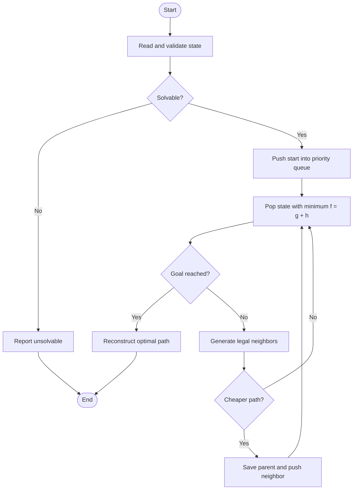

# Lab Report: 8-Puzzle using A* Search

**Course:** Artificial Intelligence  
**Lab:** Heuristic Search  
**Language:** Python 3  

---

## Title

**Optimal Solution of the 8-Puzzle using A* Search and Manhattan Distance**

---

## Objectives

- Represent the 8-puzzle as a state-space search problem.
- Implement A* search with the Manhattan-distance heuristic.
- Detect unsolvable inputs and reconstruct the optimal solution path.
- Reduce unnecessary work using a priority queue and best-cost tracking.

---

## Requirements

| Item | Detail |
|---|---|
| Language | Python 3.x |
| Libraries | Python standard library only |
| Concepts | A* search, heuristic, priority queue, state-space search |

---

## Introduction

The **8-puzzle** contains eight numbered tiles and one blank cell on a 3×3 board. A legal move shifts the blank **up, down, left, or right**. The task is to transform an initial state into the goal state:

```text
1 2 3
4 5 6
7 8 _
```

A* selects the state with the smallest estimated total cost:

```text
f(n) = g(n) + h(n)
```

Here, `g(n)` is the number of moves made and `h(n)` is the sum of the Manhattan distances of all numbered tiles from their goal positions. Manhattan distance is admissible and consistent, so A* returns an optimal solution.

---

## Algorithm

1. Validate that the input contains every value from `0` to `8` once.
2. Count inversions; an odd count means a 3×3 puzzle is unsolvable.
3. Insert the initial state into a min-priority queue using `f = g + h`.
4. Remove the state with the smallest `f` value.
5. If it is the goal, follow parent links to reconstruct the solution.
6. Otherwise, generate every legal blank movement.
7. Record and enqueue a neighbor only when a cheaper path to it is found.
8. Repeat from Step 4.

The implementation updates the heuristic using only the single tile moved into the blank, instead of recalculating all tile distances.

### Complexity

- **Time:** `O(b^d)` in the worst case, where `b ≤ 4` and `d` is solution depth.
- **Space:** `O(b^d)` for the frontier, costs, and parent links.

---

## Core Code

The essential A* loop is:

```python
def solve(start):
    start = tuple(start)
    if len(start) != 9 or set(start) != set(range(9)):
        raise ValueError("state must contain each number from 0 to 8 exactly once")
    if not is_solvable(start):
        return None

    serial = count()
    start_h = manhattan(start)
    frontier = [(start_h, start_h, next(serial), start)]
    best_g = {start: 0}
    parent = {start: (None, None)}
    expanded = 0

    while frontier:
        f, h, _, state = heappop(frontier)
        g = f - h
        if g != best_g.get(state):
            continue
        if state == GOAL:
            states, moves = [], []
            while state is not None:
                states.append(state)
                state, move = parent[state]
                if move:
                    moves.append(move)
            return states[::-1], moves[::-1], expanded

        expanded += 1
        blank = state.index(0)
        br, bc = divmod(blank, SIZE)
        for swap, move in NEIGHBORS[blank]:
            next_state = list(state)
            tile = next_state[swap]
            next_state[blank], next_state[swap] = tile, 0
            next_state = tuple(next_state)
            next_g = g + 1
            if next_g < best_g.get(next_state, float("inf")):
                tr, tc = GOAL_POS[tile]
                old_d = abs(swap // SIZE - tr) + abs(swap % SIZE - tc)
                new_d = abs(br - tr) + abs(bc - tc)
                next_h = h - old_d + new_d
                best_g[next_state] = next_g
                parent[next_state] = (state, move)
                heappush(frontier, (next_g + next_h, next_h,
                                    next(serial), next_state))
```

The complete executable program is in `eight_puzzle_astar.py`.

---

## Flowchart



---

## Execution and Output

**Command:**

```bash
python3 eight_puzzle_astar.py
```

**Output:**

```text
Solved optimally in 2 moves: Down -> Right
Expanded nodes: 2

Start
1 2 3
4 _ 6
7 5 8

1. Down
1 2 3
4 5 6
7 _ 8

2. Right
1 2 3
4 5 6
7 8 _
```

A custom state can be supplied as nine space-separated values, where `0` is the blank:

```bash
python3 eight_puzzle_astar.py 1 2 3 4 0 6 7 5 8
```

---

## Result Analysis

| Measure | Result |
|---|---|
| Initial Manhattan distance | 2 |
| Optimal moves | 2 |
| Expanded states | 2 |
| Solution | Down → Right |

The solution length equals the initial heuristic value, confirming that the sample reaches the goal through the shortest possible path. Duplicate-state pruning prevents repeated exploration, while inversion checking rejects impossible puzzles before search begins.

---

## Conclusion

The 8-puzzle was solved successfully using A* search with Manhattan distance. The algorithm is complete and optimal for every solvable 3×3 state. Tuple-based states, precomputed legal moves, incremental heuristic updates, and best-cost tracking keep the implementation both efficient and concise.

---

*End of Lab Report*
