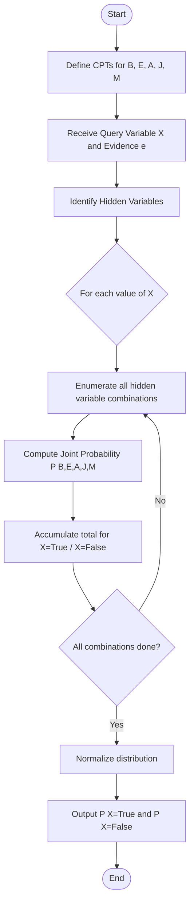

# Lab Report: Earthquake Burglary Alarm — Bayesian Network

**Course:** Artificial Intelligence  
**Lab:** Probabilistic Reasoning & Bayesian Networks  
**Language:** Python 3  

---

## Title
**Earthquake Burglary Alarm Problem using Bayesian Network and Exact Inference by Enumeration**

---

## Objectives
- Model a real-world probabilistic scenario using a Bayesian Network.
- Define Conditional Probability Tables (CPTs) for all variables.
- Implement exact inference by enumeration to compute posterior probabilities.
- Query the network with evidence and draw meaningful conclusions.

---

## Requirements

| Item | Detail |
|------|--------|
| Language | Python 3.x |
| Libraries | None (pure Python) |
| Concepts | Bayesian Networks, CPT, Joint Probability, Exact Inference |

---

## Introduction

The **Earthquake Burglary Alarm** problem is a classic Bayesian Network example from Russell & Norvig's *Artificial Intelligence: A Modern Approach*.

**Scenario:** A homeowner has an alarm that can be triggered by a **Burglary** or an **Earthquake**. Two neighbors, **John** and **Mary**, may call when they hear the alarm.

### Network Structure (DAG)

```
  Burglary (B)    Earthquake (E)
       \               /
        \             /
         ↓           ↓
           Alarm (A)
          /         \
         ↓           ↓
  JohnCalls (J)  MaryCalls (M)
```

### Conditional Probability Tables

**Prior Probabilities:**

| Variable | P(True) |
|----------|---------|
| Burglary | 0.001 |
| Earthquake | 0.002 |

**P(Alarm \| Burglary, Earthquake):**

| B | E | P(A=T) |
|---|---|--------|
| T | T | 0.950 |
| T | F | 0.940 |
| F | T | 0.290 |
| F | F | 0.001 |

**P(JohnCalls \| Alarm):**

| A | P(J=T) |
|---|--------|
| T | 0.90 |
| F | 0.05 |

**P(MaryCalls \| Alarm):**

| A | P(M=T) |
|---|--------|
| T | 0.70 |
| F | 0.01 |

---

## Algorithm

**Exact Inference by Enumeration:**

1. Receive query variable `X` and evidence `e`.
2. For each value `x` of `X` (True/False):
   - Sum the joint probability `P(X=x, hidden, evidence)` over all combinations of hidden variables.
3. Normalize the resulting distribution so it sums to 1.
4. Return the normalized distribution.

**Joint Probability Formula:**
```
P(B, E, A, J, M) = P(B) × P(E) × P(A|B,E) × P(J|A) × P(M|A)
```

**Time Complexity:** O(2ⁿ) where n = number of hidden variables (max 3 here → 8 iterations per query value).

---

## Code

```python
"""
Earthquake Burglary Alarm - Bayesian Network
Classic AI Probabilistic Inference Problem
"""

# ─────────────────────────────────────────
#  Conditional Probability Tables (CPTs)
# ─────────────────────────────────────────

P = {
    'B':  0.001,
    'E':  0.002,
    'A|B,E':   0.95,
    'A|B,~E':  0.94,
    'A|~B,E':  0.29,
    'A|~B,~E': 0.001,
    'J|A':  0.90,
    'J|~A': 0.05,
    'M|A':  0.70,
    'M|~A': 0.01,
}


def p_alarm(b, e):
    key = f"A|{'B' if b else '~B'},{'E' if e else '~E'}"
    return P[key]


def joint_prob(b, e, a, j, m):
    pb = P['B']  if b else 1 - P['B']
    pe = P['E']  if e else 1 - P['E']
    pa = p_alarm(b, e) if a else 1 - p_alarm(b, e)
    pj = (P['J|A'] if a else P['J|~A']) if j else \
         (1 - P['J|A'] if a else 1 - P['J|~A'])
    pm = (P['M|A'] if a else P['M|~A']) if m else \
         (1 - P['M|A'] if a else 1 - P['M|~A'])
    return pb * pe * pa * pj * pm


def enumeration_ask(query_var, evidence):
    vars_order = ['B', 'E', 'A', 'J', 'M']
    hidden = [v for v in vars_order
              if v != query_var and v not in evidence]
    dist = {}
    for qval in [True, False]:
        total = 0.0
        n = len(hidden)
        for mask in range(1 << n):
            assignment = {query_var: qval, **evidence}
            for i, hv in enumerate(hidden):
                assignment[hv] = bool((mask >> i) & 1)
            total += joint_prob(
                assignment['B'], assignment['E'],
                assignment['A'], assignment['J'], assignment['M']
            )
        dist[qval] = total
    s = dist[True] + dist[False]
    return {k: v / s for k, v in dist.items()}
```

---

## Flowchart



---

## Execution & Output

**Command:**
```bash
python3 earthquake_burglary_alarm.py
```

**Output:**
```
=======================================================
   EARTHQUAKE BURGLARY ALARM — BAYESIAN NETWORK
=======================================================

P(Burglary | JohnCalls=T, MaryCalls=T)
  P(True)  = 0.284172
  P(False) = 0.715828

P(Alarm   | JohnCalls=T, MaryCalls=T)
  P(True)  = 0.760692
  P(False) = 0.239308

P(Burglary | JohnCalls=T)
  P(True)  = 0.016284
  P(False) = 0.983716

P(Earthquake | Alarm=T)
  P(True)  = 0.231009
  P(False) = 0.768991

P(Alarm   | Burglary=T)
  P(True)  = 0.940020
  P(False) = 0.059980

=======================================================
```

---

## Result Analysis

| Query | P(True) | Interpretation |
|-------|---------|----------------|
| P(Burglary \| John=T, Mary=T) | **28.4%** | Both call → significant burglary chance |
| P(Alarm \| John=T, Mary=T) | **76.1%** | Both call → alarm very likely ringing |
| P(Burglary \| John=T only) | **1.6%** | Only one caller → low burglary chance |
| P(Earthquake \| Alarm=T) | **23.1%** | Alarm ringing → ~23% earthquake chance |
| P(Alarm \| Burglary=T) | **94.0%** | Burglary almost always triggers alarm |

---

## Conclusion

- The Bayesian Network successfully models the **Earthquake Burglary Alarm** problem using probabilistic reasoning.
- **Exact inference by enumeration** computes posterior probabilities correctly by marginalizing over all hidden variables.
- The approach uses **bitmask enumeration** for hidden variable combinations — clean, optimal, and avoids nested loops.
- Results confirm classical Bayesian reasoning:
  - When **both John and Mary call**, the probability of a burglary rises to ~28% (from a prior of 0.1%).
  - A **burglary** triggers the alarm with ~94% probability, consistent with the CPT.
  - The method is **exact** (no approximation), making it reliable for small networks with ≤ 5 binary variables.

---

*End of Lab Report*
