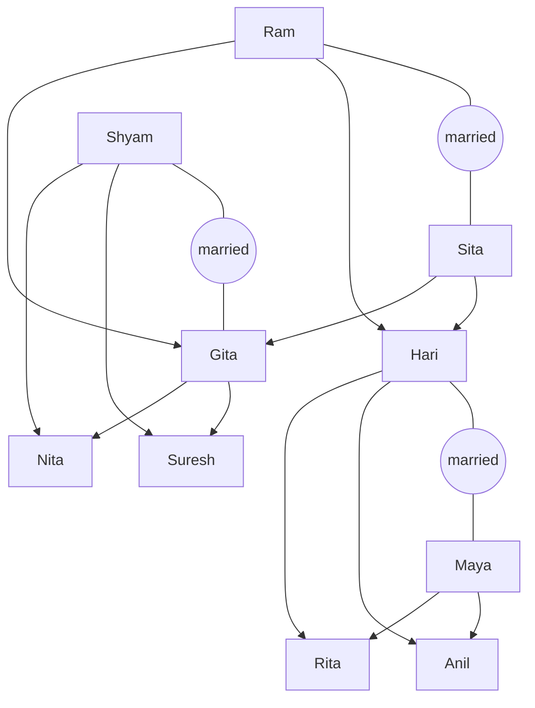
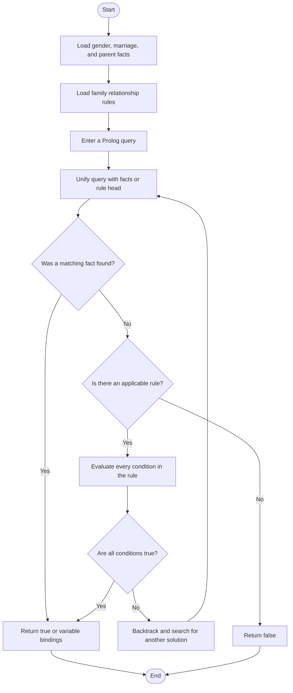

# Lab Report: Family Tree — Prolog

**Course:** Artificial Intelligence  
**Lab:** Knowledge Representation and Logic Programming  
**Language:** Prolog (SWI-Prolog)  

---

## Title
**Implementation of a Family Tree Expert System using Prolog**

---

## Objectives
- Represent family information using Prolog facts and predicates.
- Define logical rules for common family relationships.
- Use queries to retrieve knowledge from a family-tree knowledge base.
- Apply recursion to determine ancestor relationships.
- Understand facts, rules, variables, unification, and inference in Prolog.

---

## Requirements

| Item | Detail |
|------|--------|
| Language | Prolog |
| Interpreter | SWI-Prolog |
| Editor | Visual Studio Code |
| VS Code extension | Any trusted Prolog syntax-support extension (optional) |
| Concepts | Facts, rules, predicates, queries, unification, recursion |

---

## Introduction

**Prolog** stands for *Programming in Logic*. It is a declarative programming language commonly used in artificial intelligence, expert systems, natural-language processing, and knowledge representation. Instead of describing every computational step, a Prolog program stores facts and rules. The Prolog inference engine then searches this knowledge base to answer queries.

This project represents a fictional family using three types of basic facts:

- `male/1` and `female/1` describe gender.
- `married/2` records married couples.
- `parent/2` records direct parent-child relationships.

Rules derive additional relationships including father, mother, child, son, daughter, spouse, sibling, brother, sister, grandparent, uncle, aunt, cousin, and ancestor.

### Facts, Rules, and Queries

**Fact:** A statement stored as true in the knowledge base.

```prolog
male(ram).
parent(ram, hari).
```

**Rule:** A relationship that is true when all conditions in its body are true.

```prolog
father(Father, Child) :-
    male(Father),
    parent(Father, Child).
```

**Query:** A question submitted to the Prolog inference engine.

```prolog
?- father(ram, hari).
```

In Prolog, atoms such as `ram` begin with a lowercase letter, while variables such as `Father` begin with an uppercase letter.

---

## Family Tree Structure

```text
                         Ram ───── Sita
                              │
                   ┌──────────┴──────────┐
                Hari ───── Maya       Shyam ───── Gita
                    │                         │
              ┌─────┴─────┐             ┌────┴─────┐
            Anil         Rita          Suresh      Nita
```

### Graphical Representation



An arrow from one person to another represents a parent-child relationship.

---

## Algorithm

1. Store every person's gender as a `male/1` or `female/1` fact.
2. Store marriages with `married/2` facts.
3. Store direct parent-child relationships with `parent/2` facts.
4. Define rules for relationships that can be inferred from the stored facts.
5. Accept a query from the user.
6. Match the query against relevant facts and rules using unification.
7. Recursively evaluate rule conditions when necessary.
8. Display `true`, `false`, or the values found for query variables.

### Recursive Ancestor Logic

The `ancestor/2` predicate has two cases:

1. **Base case:** A direct parent is an ancestor of the child.
2. **Recursive case:** If `A` is the parent of `B`, and `B` is an ancestor of `C`, then `A` is an ancestor of `C`.

```text
ancestor(A, C) = parent(A, C)
             OR parent(A, B) AND ancestor(B, C)
```

---

## Code

```prolog
/*
   Family Tree Expert System in Prolog

   Facts describe people, marriages, and parent relationships.
   Rules infer other relationships from those facts.
*/

% Gender facts
male(ram).
male(hari).
male(shyam).
male(anil).
male(suresh).

female(sita).
female(gita).
female(maya).
female(rita).
female(nita).

% Marriage facts
married(ram, sita).
married(hari, maya).
married(shyam, gita).

% Parent facts: parent(Parent, Child)
parent(ram, hari).
parent(sita, hari).
parent(ram, gita).
parent(sita, gita).

parent(hari, anil).
parent(maya, anil).
parent(hari, rita).
parent(maya, rita).

parent(shyam, suresh).
parent(gita, suresh).
parent(shyam, nita).
parent(gita, nita).

% Derived relationship rules
father(Father, Child) :-
    male(Father),
    parent(Father, Child).

mother(Mother, Child) :-
    female(Mother),
    parent(Mother, Child).

child(Child, Parent) :-
    parent(Parent, Child).

son(Son, Parent) :-
    male(Son),
    parent(Parent, Son).

daughter(Daughter, Parent) :-
    female(Daughter),
    parent(Parent, Daughter).

spouse(Person1, Person2) :-
    married(Person1, Person2).
spouse(Person1, Person2) :-
    married(Person2, Person1).

sibling(Person1, Person2) :-
    dif(Person1, Person2),
    parent(CommonParent, Person1),
    parent(CommonParent, Person2).

brother(Brother, Person) :-
    male(Brother),
    sibling(Brother, Person).

sister(Sister, Person) :-
    female(Sister),
    sibling(Sister, Person).

grandparent(Grandparent, Grandchild) :-
    parent(Grandparent, Parent),
    parent(Parent, Grandchild).

grandfather(Grandfather, Grandchild) :-
    male(Grandfather),
    grandparent(Grandfather, Grandchild).

grandmother(Grandmother, Grandchild) :-
    female(Grandmother),
    grandparent(Grandmother, Grandchild).

uncle(Uncle, Person) :-
    male(Uncle),
    sibling(Uncle, Parent),
    parent(Parent, Person).

aunt(Aunt, Person) :-
    female(Aunt),
    sibling(Aunt, Parent),
    parent(Parent, Person).

cousin(Person1, Person2) :-
    dif(Person1, Person2),
    parent(Parent1, Person1),
    parent(Parent2, Person2),
    sibling(Parent1, Parent2).

% Base case: a parent is an ancestor.
ancestor(Ancestor, Descendant) :-
    parent(Ancestor, Descendant).

% Recursive case: an ancestor of a parent is an ancestor of the child.
ancestor(Ancestor, Descendant) :-
    parent(Ancestor, Intermediate),
    ancestor(Intermediate, Descendant).
```

---

## Flowchart



---

## Execution and Output

### Installation

Install SWI-Prolog from <https://www.swi-prolog.org/download/stable>. On Ubuntu or Debian, it can normally be installed with:

```bash
sudo apt update
sudo apt install swi-prolog
```

In VS Code, open the Extensions view with `Ctrl+Shift+X` and optionally install a trusted Prolog syntax-highlighting extension.

### Running the Program

Open a terminal in the folder containing `family_tree.pl`, then run:

```bash
swipl family_tree.pl
```

When the `?-` prompt appears, enter queries such as the following.

### Sample Output

```prolog
?- father(hari, anil).
true.

?- mother(gita, nita).
true.

?- grandfather(ram, suresh).
true.

?- sister(rita, anil).
true.

?- uncle(hari, suresh).
true.

?- cousin(anil, nita).
true.

?- spouse(maya, hari).
true.

?- ancestor(ram, nita).
true.

?- father(shyam, anil).
false.

?- father(Father, anil).
Father = hari.

?- setof(Grandparent, grandparent(Grandparent, nita), Grandparents).
Grandparents = [ram, sita].

?- setof(Cousin, cousin(anil, Cousin), Cousins).
Cousins = [nita, suresh].
```

To stop SWI-Prolog, enter:

```prolog
?- halt.
```

---

## Test Cases and Result Analysis

| No. | Query | Expected result | Interpretation |
|----:|-------|-----------------|----------------|
| 1 | `father(hari, anil).` | `true` | Hari is Anil's father. |
| 2 | `mother(gita, nita).` | `true` | Gita is Nita's mother. |
| 3 | `grandfather(ram, suresh).` | `true` | Ram is Suresh's grandfather. |
| 4 | `sister(rita, anil).` | `true` | Rita is Anil's sister. |
| 5 | `uncle(hari, suresh).` | `true` | Hari is Suresh's uncle. |
| 6 | `cousin(anil, nita).` | `true` | Anil and Nita are cousins. |
| 7 | `spouse(maya, hari).` | `true` | The spouse rule works in reverse order. |
| 8 | `ancestor(ram, nita).` | `true` | Ram is an ancestor of Nita. |
| 9 | `father(shyam, anil).` | `false` | Shyam is not Anil's father. |
| 10 | `father(Father, anil).` | `Father = hari` | A variable retrieves the matching person. |

The results demonstrate that Prolog can infer relationships that are not stored directly. For example, the knowledge base does not contain the fact `uncle(hari, suresh)`. Prolog proves it using the facts that Hari and Gita are siblings and that Gita is Suresh's parent.

`setof/3` is used when a query might discover the same person through more than one shared parent. It removes duplicate answers and returns a sorted list.

---

## Advantages

- The program is short, readable, and easy to extend.
- New family members can be added by inserting facts without changing existing rules.
- Prolog automatically performs searching, unification, and backtracking.
- Recursive rules can represent relationships across any number of generations.

## Limitations

- The knowledge base contains only explicitly entered people and parent relationships.
- Incorrect or contradictory input facts are not automatically rejected.
- Some general relationships, such as uncle and aunt by marriage, are outside the current definitions.
- A cyclic `parent/2` relationship would make recursive ancestor queries unsafe; real family data should therefore remain acyclic.

---

## Conclusion

- The family tree was successfully represented as a Prolog knowledge base.
- Facts stored basic information, while rules inferred direct and indirect family relationships.
- Queries correctly identified parents, siblings, grandparents, cousins, spouses, and ancestors.
- The recursive `ancestor/2` predicate demonstrated how Prolog solves multi-generation relationships.
- This experiment shows that logic programming is an effective approach to symbolic knowledge representation and reasoning.

---

## References

1. SWI-Prolog, “SWI-Prolog Documentation.” <https://www.swi-prolog.org/Documentation.html>
2. SWI-Prolog, “SWI-Prolog Downloads.” <https://www.swi-prolog.org/download/stable>
3. Visual Studio Code, “Use extensions in Visual Studio Code.” <https://code.visualstudio.com/docs/getstarted/extensions>

---

*End of Lab Report*
